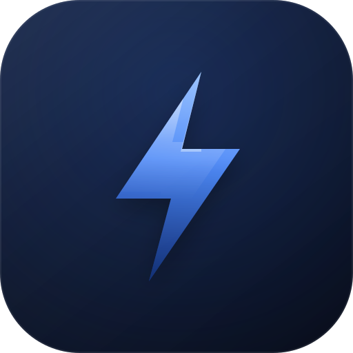

<p align="center">
  
</p>

# OpenBridge WiZ Local Platform

**Control WiZ lights locally over UDP through [OpenBridge](https://github.com/nubisco/openbridge) and Apple HomeKit.**

No cloud, no WiZ account, and no broadcast discovery to lose them behind.

[](https://github.com/nubisco/openbridge-wiz-local-platform/actions/workflows/ci.yml)
[](https://github.com/nubisco/openbridge-wiz-local-platform/releases)
[](https://www.npmjs.com/package/@nubisco/openbridge-wiz-local-platform)
[](https://www.npmjs.com/package/@nubisco/openbridge-wiz-local-platform)
[](LICENSE)
[](https://docs.nubisco.io/openbridge-wiz-local-platform/)

## Table of Contents

- [Quick Start](#quick-start)
- [Why not homebridge-wiz-lan?](#why-not-homebridge-wiz-lan)
- [Features](#features)
- [Supported Devices](#supported-devices)
- [Documentation](#documentation)
- [Contributing](#contributing)
- [Security](#security)
- [Support this project](#support-this-project)
- [License](#license)

## Quick Start

```sh
npm install -g @nubisco/openbridge-wiz-local-platform
```

Find a bulb's MAC and confirm it answers:

```sh
echo -n '{"method":"getPilot","params":{}}' | nc -u -w 2 192.168.1.154 38899
```

```json
{ "method": "getPilot", "result": { "mac": "d8a011bcc1f7", "state": true, "dimming": 100, "temp": 2700 } }
```

Add it to `~/.openbridge/config.json` and restart:

```json
{
  "name": "@nubisco/openbridge-wiz-local-platform",
  "enabled": true,
  "config": {
    "pollIntervalSeconds": 30,
    "devices": [{ "name": "Piano", "mac": "d8a011bcc1f7", "host": "192.168.1.154", "kind": "rgbtw" }]
  }
}
```

Give every bulb a DHCP reservation so its address does not move.

## Why not homebridge-wiz-lan?

That plugin is good, and this one exists despite that rather than because of any defect in it.

WiZ's discovery is a UDP broadcast to `255.255.255.255:38899`. Consumer mesh access points
drop broadcast frames to save airtime: a TP-Link Deco mesh answers unicast on that exact
port in milliseconds while swallowing every broadcast sent to it. The consequence is
one-way. A bulb that stops answering is marked offline, and recovering it needs
rediscovery, which is the broadcast that never arrives. Give five bulbs DHCP reservations
and all five change address at once, and every one becomes permanently invisible.

Addresses come from configuration here, so there is nothing to discover and nothing to lose.

Accessory UUIDs match that plugin's, so migrating keeps each bulb's HomeKit room, scenes
and automations. See [Migrating](https://docs.nubisco.io/openbridge-wiz-local-platform/migrating).

## Features

- **No discovery dependency.** Every bulb is addressed directly. A mesh that drops
  broadcast cannot hide your lights.
- **Honest reachability.** A bulb that stops answering reports `reachable: false` with the
  reason attached and answers HomeKit with a communication failure, so the tile greys out
  instead of claiming to be switched off.
- **Pushed state.** A light switched at the wall or in the WiZ app reaches HomeKit on the
  next poll, rather than waiting for something to read the characteristic.
- **Names from configuration.** Rename a bulb, restart, and it is renamed. No cached name
  outliving the config that set it.
- **Writes are read back.** A bulb clamps values it dislikes, so what is reported is what
  the bulb accepted, not what was asked for.
- **Coalesced requests.** Five characteristics read at once put one datagram on the wire,
  not five.

## Supported Devices

| `kind`     | HomeKit gets                                        |
| ---------- | --------------------------------------------------- |
| `rgbtw`    | On, Brightness, Colour Temperature, Hue, Saturation |
| `tw`       | On, Brightness, Colour Temperature                  |
| `dimmable` | On, Brightness                                      |
| `socket`   | On                                                  |

Declared rather than detected: a probe only sees the channels in a bulb's current state, so
a colour bulb in white mode would otherwise silently lose its colour controls.

Scenes and built-in light effects are readable but not settable.

## Documentation

Full documentation at **[docs.nubisco.io/openbridge-wiz-local-platform](https://docs.nubisco.io/openbridge-wiz-local-platform/)**

- [Introduction](https://docs.nubisco.io/openbridge-wiz-local-platform/introduction)
- [Installation](https://docs.nubisco.io/openbridge-wiz-local-platform/installation)
- [Finding your bulbs](https://docs.nubisco.io/openbridge-wiz-local-platform/finding-bulbs)
- [Configuration](https://docs.nubisco.io/openbridge-wiz-local-platform/configuration)
- [Migrating from homebridge-wiz-lan](https://docs.nubisco.io/openbridge-wiz-local-platform/migrating)
- [How it works](https://docs.nubisco.io/openbridge-wiz-local-platform/how-it-works)
- [Troubleshooting](https://docs.nubisco.io/openbridge-wiz-local-platform/troubleshooting)

## Contributing

Contributions are welcome. See [CONTRIBUTING.md](CONTRIBUTING.md).

```sh
npm install
npm run quality:check
```

## Security

Please report vulnerabilities privately rather than in a public issue. See
[SECURITY.md](SECURITY.md).

## Support this project

If this plugin helps your OpenBridge setup, consider sponsoring development. Maintaining
device integrations, testing against real hardware and answering support questions takes
significant time, and GitHub Sponsors is what makes long-term maintenance sustainable.

- ❤️ [Sponsor via GitHub](https://github.com/sponsors/joseporto)

## License

[MIT](LICENSE) © Nubisco
